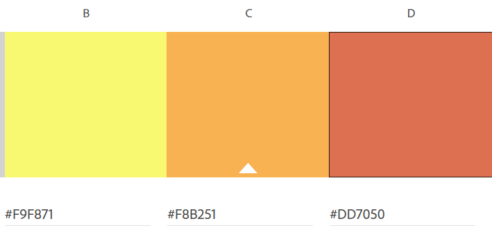
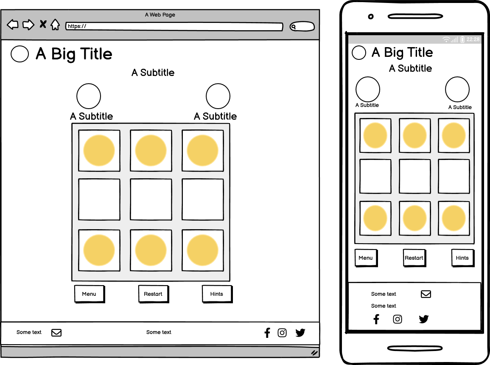

# Elemental Lumina - A Lights Out Based Game
(Developer: Hannah Bowles)

[Live webpage](https://hanmb17.github.io/C1_MS2_LIGHTSOUT/)

Elemental Lumina offers a different take on the timeless Lights Out game originally released by Tiger Electronics in 1995. In this revamped version, users find themselves on a quest to free the trapped Lumina by solving complex puzzles. The key to success is collecting elemental orbs by following a specific pattern, similar to the classic lights-out pattern.

As users progress through the game's four levels, the challenges become progressively more difficult, pushing their puzzle-solving skills to the limit. The ultimate goal is to collect all orbs in the correct sequence to complete each level and rescue all the trapped Lumina.

For those who enjoy the nostalgia of the original game, Elemental Lumina also features a free-play mode. Here, players can tailor their game by selecting the grid size they want to play on and choosing the number of hints at their disposal. This mode offers a fresh yet familiar experience reminiscent of classic Lights Out gameplay.
## Table of Content

1. [Project Goals](#project-goals)
    1. [User Goals](#user-goals)
    2. [Site Owner Goals](#site-owner-goals)
2. [User Experience](#user-experience)
    1. [Target Audience](#target-audience)
    2. [User Requirements and Expectations](#user-requirements-and-expectations)
    3. [User Stories](#user-stories)
3. [Design](#design)
    1. [Design Choices](#design-choices)
    2. [Colours](#colours)
    3. [Fonts](#fonts)
    4. [Structure](#structure)
    5. [Wireframes](#wireframes)
4. [Technologies Used](#technologies-used)
    1. [Languages](#languages)
    2. [Frameworks and Tools](#frameworks-and-tools)
5. [Features](#features)
6. [Testing](#testing)
    1. [HTML Validation](#HTML-validation)
    2. [CSS Validation](#CSS-validation)
    3. [Accessibility](#accessibility)
    4. [Performance](#performance)
    5. [Device testing](#performing-tests-on-various-devices)
    6. [Browser compatibility](#browser-compatibility)
    7. [Testing user stories](#testing-user-stories)
8. [Bugs](#bugs)
9. [Deployment](#deployment)
10. [Credits](#credits)
11. [Acknowledgements](#acknowledgements)

## Project Goals

### User Goals
- Easily grasp the concept of Elemental Lumina as a modern twist on the classic Lights Out game.
- Understand the objective of freeing Lumina by solving complex puzzles and collecting elemental orbs.
- Understand the gameplay mechanics involving the lights-out pattern and its connection to collecting elemental orbs.
- Advance through the game's levels.
- Experience the satisfaction of completing levels and rescuing Lumina.
- Explore the free-play mode and its customisation options for a personalised gaming experience.

### Site Owner Goals
- Attract a diverse range of gamers interested in puzzle-solving and strategy.
- Highlight the unique selling points of Elemental Lumina, emphasising its revamped gameplay.
- Present the game's features and mechanics clearly and engagingly.
- Encourage users to engage with both the main game and the free-play mode.
- Promote a sense of nostalgia for the classic Lights Out game while offering fresh gameplay.

### Developer Goals
- Develop an intuitive and user-friendly interface for players of various skill levels.
- Communicate the game's premise, mechanics, and objectives in a concise yet informative way.
- Create a seamless and enjoyable gameplay experience that balances challenge and reward.
- Ensure smooth progression through levels, maintaining user engagement and motivation.
- Implement the free-play mode with customisable options, respecting the classic Lights Out experience.
 
## User Experience

### Target Audience
- Casual gamers seeking a modern take on a classic game.
- Puzzle enthusiasts interested in challenging gameplay.
- Users are nostalgic for the original Lights Out game.
- Individuals who enjoy strategic thinking and problem-solving.

### User Requirements and Expectations
- Clear explanation of Elemental Lumina's unique gameplay and objective.
- A user-friendly interface that supports intuitive navigation through levels.
- Instruction on how to play.
- Gradually increasing challenges that test puzzle-solving skills.
- A sense of accomplishment upon completing levels and rescuing Lumina.
- Customisation options in the free-play mode for a personalised experience.
- Responsive design that adapts to users' screen size.

### User Stories

#### First-time User 
1. As a first-time user, I want to understand how Elemental Lumina differs from the classic Lights Out game.
2. As a first-time user, I want to learn how the lights-out pattern is connected to collecting elemental orbs.
3. As a first-time user, I want to be introduced to the gradual challenge increase as I progress through levels.
5. As a first-time user, I want to experience the satisfaction of completing levels and rescuing Lumina.
6. As a first-time user, I want to explore the free-play mode and customise my gameplay experience.

#### Returning User
7. As a returning user, I want to dive back into the challenging world of Elemental Lumina.
8. As a returning user, I want to test my skills on increasingly difficult levels.
9. As a returning user, I want to relive the excitement of rescuing Lumina and progressing through the story.
10. As a returning user, I want to experiment with different grid sizes and hint options in the free-play mode.   

## Design

### Design Choices
### Colours
When selecting the colours for this project, I wanted to give the user an out-of-space and alien feel. I chose a dark blue to represent space over black for a softer look. I then chose green to act as the secondary colour to add a feeling of being on another planet. I chose to use white mostly for the font as it contrasted nicely against the dark blue.To make the HUD and game buttons stand out, I opted for a purple colour that pops nicely over any blue areas and contrasts nicely against the green colour.

- #1C0539 Dark Blue - used as background colours.
- #457D75; used for buttons and certain headers.
- #FFFFFF used for text of the body.
- #421A61 used for overlay and main hue of the game elements.

Main Colours

Level colours:
As I was creating levels I wanted them all to stand out visually but complement the main colours:

#### Level 1  
To represent Fire I used the following colours:

Level 1 Colours

#### Level 2 
To represent water I used the following colours:

Level 2 Colours

#### Level 3 
To represent Earth I used the following colours:

Level 3 Colours

#### Level 4
To represent Air I used the following colours:

Level 4 Colours

### Fonts
Google Fonts is used to import the 'Yusei Magic and Roboto' font used throughout the website:
- [Yusei Magic](https://fonts.google.com/specimen/Yusei+Magic)
- [Roboto](https://fonts.google.com/specimen/Roboto) 
  
Yusei Magic whimsical design makes it perfect for headers, adding wonder and adventure to the game.
 
Roboto was the clear choice for the game's UI and text. Its modern, easy-to-read style guides players through menus and instructions while maintaining a professional look that doesn't overshadow gameplay.
 
'Roboto' and 'Yusei Magic' fonts blend perfectly in the game, providing solid mechanics and enhancing emotional connection to the story. They contribute to the unique identity and overall user experience.

### Structure
The site contains 3 pages, the home page, game page and 404 page

### Wireframes

Home

Game Page

Level Play Modal

Free Play Modal

## Technologies Used

### Languages
- [HTML](https://en.wikipedia.org/wiki/HTML)
- [CSS](https://en.wikipedia.org/wiki/CSS)
- [JavaScript](https://www.javascript.com)

### Frameworks and Tools
- [Bootstrap v5.3](https://getbootstrap.com/)
- [Git](https://git-scm.com/)
- [Github](https://github.com/)
- [GitPod](https://www.gitpod.io/)
- [Tiny PNG](https://tinypng.com/)
- [Balsamiq](https://balsamiq.com/wireframes/)
- [Google Fonts](https://fonts.google.com/about)
- [Font Awesome](https://fontawesome.com/search)
- [Code Pen](https://codepen.io/)
- [Affinity Developer 2 and Photo 2](https://affinity.serif.com/en-gb/)
- [Grammarly](https://www.grammarly.com/)
- [W3C validator](https://validator.w3.org/)
- [Jigsaw CSS validator](https://jigsaw.w3.org/css-validator/)
- [WAVE Web Accessibility Evaluation Tool](https://wave.webaim.org/)

## Features
The website has two main pages. The homepage and game page are easily accessible between each other by choosing a game mode from the game menu homepage and selecting the 'home' icon on the game page, the logo in the header or the home button in the modal. There is an additional page; A 404 error page, which will be loaded if the user navigates to an invalid address.

### Existing Features

#### Page header 
This appears on all pages and features the game's logo and name. The user is also redirected to the home page when clicked.

#### Introduction section.
Contains the back story of the game to help the user emerge themselves in the back story of the game.

#### Home page game menu
There are three buttons for the user to choose from; play game, how to play and freeplay. Giving the user a choice a choice of how they want to play.
- Play Button - is a level-based game which follows the main theme of the game.
- How to Play - displays the instructions modal.
- Freeplay - allows the user to control their game size and hints.

#### How to play section
This feature is a static background pop-up modal from Bootstrap 5.3 that gives the user detailed instructions on how to play the Elemental Lumia game.
It can be accessed on the homepage by selecting the 'How to Play' button below the play button.
When selected, the instructions and rules will pop up as an overlay to the page's main content.
When the user is finished with the instructions they can easily close the modal. This can be achieved by clicking anywhere on the screen, by clicking the 'X' to close button or the button labelled closed.
This can also be accessed on the games page when opening the game's toggle menu. It will pause the game countdown or timer depending on the play mode.

#### The Game Page
When the page first loads a modal is dysplayed depending on the mode the user selects from the home page.

#### Play mode - modal
- This modal contains all the information the user needs to know before they play this level.
- It displays the level number so the user knows what level they are about to start.
- They can close the modal by clicking the play button and begin to play the level.
- Alternatively, they can navigate to the home page by clicking the home button

#### The Freeplay set up a model
- This allows the user to pick the grid size they want and the number of hints they want to pay with.
- The play button allows the user to play the game with their options as it loads the game they have picked once clicked.

- This modal is reloaded if the user completes the puzzle letting them know how many moves and time they took.

#### Heads up display (HUD) Elements
- This contains the Move counter which lets the user know how many moves they have made.
- the timer: In the level play, this acts as a countdown to the end of the game,  in the free play mode, this acts as a timer timing how long the user has been playing

#### Game Grid
- The grid is different sizes depending on what level the user is playing or what size they have chosen to play in free-play mode. 

- All grid tiles are clickable and when clicked, they either produce a new orb or remove an orb in the play mode, or light up or turn the light off in the freeplay mdoe. The status of the adjective tiles is also affected. 

#### In game menu bar
The menu contains the main game controls.

Hint button 
- Features a display section that allows the user to see how many hints they have.
- On click it will reveal a hint to solve the current state of the board by the appearance of a flashing yellow light.
- When activated it is deactivated until the original hint offered has been played this helps anciently pressing it twice and missing a hint.
- It also checks how many hints the player has and updates the display accordingly.
- If the user has no hints left or has chosen to play with no hints it will be deactivated. 

Reset button
-  This allows the user to restart the current level/game setup

Sub-menu button
This toggles open to reveal more options for the game.
It contains a home button that directs the user home and an instructions button that opens up the instructions modal.

#### Level play winning modal
This is the starting modal that reappears congratulating the user for passing the level and letting them know how many moves and how much time the took to complete the level. 

The button label is changed to next level this allows the user to continue the game or they have the option to click the home button if they want to return to the home page.

#### Level play winning modal
This is the starting modal that reappears letting the user know they have failed the puzzle but gives them the chance to replay the level.

#### 404 page
This page will be displayed if the user tries to navigate to a page that doesn't exist.
The user can select the homepage link to direct them back to the home page.

#### Footer
Seen on all pages and allows the user to discover the game's social media handles and contact them via email

### Future Features

#### Contact form
I would like to add a contact form and use Email js to send the feedback to the site admin

#### Level progression page 
I would like to add a middle page between the home page and the game page which is like a path leading around the world The game is set to allow the user to pick to play a previous level they have played and then see their progression and their progression is saved.

#### Leader Board
I would like users to be able to compare their times and how quickly they solved the levels against other users by adding a leaderboard.
I would make the introduction story into an animated scene to help users fully immerse themself in the story.

#### More Levels
I would like to add more levels.

## Testing
For all testing, please refer to the [TESTING.md](TESTING.md) file.

## Deployment
The website was deployed using GitHub Pages by following these steps:
1. In the GitHub repository navigate to the Settings tab
2. On the left-hand menu select Pages
3. For the source select Branch: master
4. After the webpage refreshes automatically you will see a ribbon on the top saying: Your site is live at https://hanmb17.github.io/C1_MS2_LIGHTSOUT/
 

You can fork the repository by following these steps:
1. Go to the GitHub repository
2. Locate the [GitHub Repository](https://github.com/Hanmb17/C1_MS2_LIGHTSOUT)
3. Click on the Fork button in the upper right-hand corner
 

You can clone the repository by following these steps:
1. Go to the GitHub repository
2. Locate the Code button above the list of files and click it
3. Select if you prefer to clone using HTTPS, SSH, or Github CLI and click the copy button to copy the URL to your clipboard
4. Open Git Bash
5. Change the current working directory to the one where you want the cloned directory
6. Type git clone and paste the URL from the clipboard ($ git clone https://github.com/Hanmb17/C1_MS2_LIGHTSOUT)
7. Press Enter to create your local clone

## Credits

### Media
Any images not created here where created by my self. 
Images were taken from [Stock Adobe](https://stock.adobe.com/uk/) with credit to the below artists

In order of appearance 

 

| Image     | Page  |  Source | Artist | Edit(s) |
|    :----:   |    :----:   |   :----:   |  :----: | :----: |
|  [Home Page and 404 Background](assets/images/space_background.svg) |  [index.html](https://hanmb17.github.io/C1_MS2_LIGHTSOUT/index.html)  |    [Adobe Stock](https://stock.adobe.com/uk/)    |     [yusufdemirci](https://stock.adobe.com/uk/images/vector-illustration-of-space/197231712/)    | Changed colours to match background and removed rocket |
|  [Game Page Background](assets/images/game_background.svg) |  [index.html](https://hanmb17.github.io/C1_MS2_LIGHTSOUT/game.html)  |    [Adobe Stock](https://stock.adobe.com/uk/)    |     [jongjawi](https://stock.adobe.com/uk/images/landscape-surface-of-planet-sky-space-science-fiction-fantasy-illustration/330880401)    | Changed colours to match colour scheme |
|  [Level 1 Alien](assets/images/fire_lumia.svg) |  [index.html](https://hanmb17.github.io/C1_MS2_LIGHTSOUT/game.html)  |    [Adobe Stock](https://stock.adobe.com/uk/)    |     [Foxelle](https://stock.adobe.com/uk/images/cute-monster-cartoon-constructor-kit-with-body-parts-alien-eyes-mouths-teeth-wings-and-horns-for-kids-toys-video-games-and-halloween-designs-vector-flat-colorful-illustration/479658039)    | Changed colours to match colour scheme and created 1 alien |
|  [Level 2 Alien](assets/images/water_lumia.svg) |  [index.html](https://hanmb17.github.io/C1_MS2_LIGHTSOUT/game.html)  |    [Adobe Stock](https://stock.adobe.com/uk/)    |     [Foxelle](https://stock.adobe.com/uk/images/cute-monster-cartoon-constructor-kit-with-body-parts-alien-eyes-mouths-teeth-wings-and-horns-for-kids-toys-video-games-and-halloween-designs-vector-flat-colorful-illustration/479658039)    | Changed colours to match colour scheme and created 1 alien |
|  [Level 3 Alien](assets/images/earth_lumia.svg) |  [index.html](https://hanmb17.github.io/C1_MS2_LIGHTSOUT/game.html)  |    [Adobe Stock](https://stock.adobe.com/uk/)    |     [Foxelle](https://stock.adobe.com/uk/images/cute-monster-cartoon-constructor-kit-with-body-parts-alien-eyes-mouths-teeth-wings-and-horns-for-kids-toys-video-games-and-halloween-designs-vector-flat-colorful-illustration/479658039)    | Changed colours to match colour scheme and created 1 alien |
|  [Level 4 Alien](assets/images/air_lumia.svg) |  [index.html](https://hanmb17.github.io/C1_MS2_LIGHTSOUT/game.html)  |    [Adobe Stock](https://stock.adobe.com/uk/)    |     [Foxelle](https://stock.adobe.com/uk/images/cute-monster-cartoon-constructor-kit-with-body-parts-alien-eyes-mouths-teeth-wings-and-horns-for-kids-toys-video-games-and-halloween-designs-vector-flat-colorful-illustration/479658039)    | Changed colours to match colour scheme and created 1 alien |

### Code 
Credits for code snippets used in order of appearance

- The HTML code for the [Modals](https://getbootstrap.com/docs/5.3/components/modal//) was taken from Bootstrap v5.3 documentation snippet 
- The JS code for the [Timers](https://www.w3schools.com/howto/howto_js_countdown.asp) was from W3 Scools - altered to fit the requirements.
- The JS for the [Random Numbers](https://www.w3schools.com/jsref/jsref_random.asp) was from W3 Scools - altered to fit the requirements.
- The JS code for the [Modals](https://getbootstrap.com/docs/5.3/components/modal//) was taken from Bootstrap v5.3 documentation snippet 
- 404 page was built using the description on [GitHub Docs](https://docs.github.com/en/pages/getting-started-with-github-pages/creating-a-custom-404-page-for-your-github-pages-site)
- The CSS for making the webpage [stretch to min height of 100vh](https://dev.to/fenok/stretching-body-to-full-viewport-height-the-missing-way-2ghd) was from a blog post on DEV by Leonid Fenko.
- To help with JS function stuctures i used JAVASCRIPT & JQUERY  by jon Duckett

### Acknowledgements

I would like to take the opportunity to thank;

- My mentor, Mo Shami, for his support and excellent guidance throughout this project.
- Iris Smok from Code Institute, my Cohort facilitator, for her wonderful advice during our weekly stand-ups.
- My partner, Pete Williams, who kept me fed and watered and helped with testing.
- My work colleagues at EWE Building Plastics, who tested the site and offered great feedback