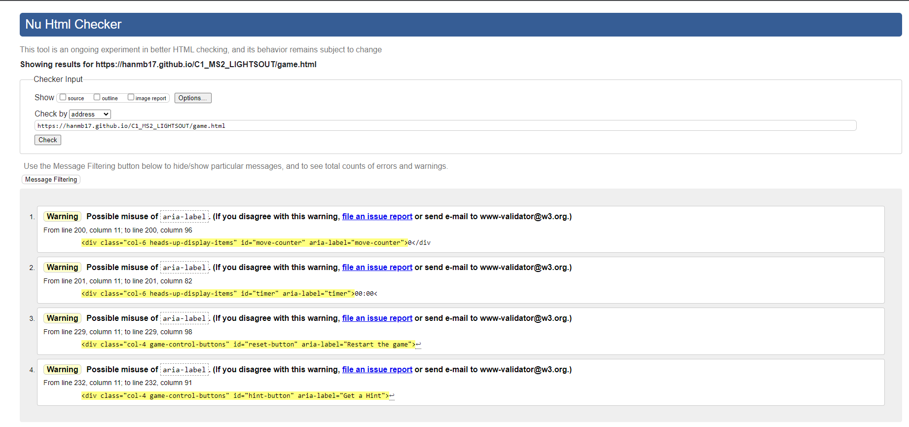

# Testing

Return back to the [README.md](README.md) file.

## Code Validation

### HTML

I have used the recommended [HTML W3C Validator](https://validator.w3.org) to validate all of my HTML files.

| Page         | W3C URL                                                                                                 | Screenshot                                                             | Notes                               |
| ------------ | ------------------------------------------------------------------------------------------------------- | ---------------------------------------------------------------------- | ----------------------------------- |
| Home         | [W3C](https://validator.w3.org/nu/?doc=https%3A%2F%2Fhanmb17.github.io%2FC1_MS2_LIGHTSOUT%2Findex.html)        |          | 1 warning. I have left the aria-label in as this div opens the instructions modal and increases accessibility for users.                     |
| Game         | [W3C](https://validator.w3.org/nu/?doc=https%3A%2F%2Fhanmb17.github.io%2FC1_MS2_LIGHTSOUT%2Fgame.html)         |          | 4 warnings. I have left the aria-labels increases accessibility for users.   |
| 404          | [W3C](https://validator.w3.org/nu/?doc=https%3A%2F%2Fhanmb17.github.io%2FC1_MS2_LIGHTSOUT%2F404.html)          |           | 1 warning section lacks heading |                  |


### CSS

I have used the recommended [CSS Jigsaw Validator](https://jigsaw.w3.org/css-validator) to validate all of my CSS files.
When I ran a test on my URL errors and warnings due to Bootstrap where present. So I chose to paste my CSS code in directly.

| Script         | Screenshot                                                             | Notes                               |
| ------------ | ---------------------------------------------------------------------- | ----------------------------------- |
| Style.css       |          | Pass: No Errors  - 2 warnings due to using dynamic nature for setting fonts                   |


### JavaScript

I have used the recommended [JShint Validator](https://jshint.com) to validate all of my JS files.

| File          | Screenshot                                                         | Notes                                                            |
| ------------- | ------------------------------------------------------------------ | ---------------------------------------------------------------- |
| game.js       |        | Pass: No Errors  |
| level1.js |  | Pass: No Errors.  Warnings for read only variables - this is correct as they are used in the game.js                                                  |
| level2.js  |   | Pass: No Errors. Warnings for read only variables - this is correct as they are used in the game.js once this sript is imported.                                                 |
| level3.js | | Pass: No Errors. Warnings for read only variables - this is correct as they are used in the game.js once this sript is imported.                                                   |
| level4.js | ![screenshot]( docs/vaildation/level4_jshint.png| Pass: No Errors. Warnings for read only variables - this is correct as they are used in the game.js once this sript is imported.                                                   |


## Browser Compatibility

I've tested my deployed project on multiple browsers to check for compatibility issues.
| Browser | Screenshot                                                                | Screenshot                                                                | Notes                 |
| ------- | ------------------------------------------------------------------------- | ------------------------------------------------------------------------- | --------------------- |
| Chrome  |   |   | Works as expected     |
| Firefox |  |  | Works as expected   |
| Edge    |     |      | Works as expected     |
| Opera   |    |     | Works as expected     |


## Responsiveness

I've tested my deployed project on multiple devices to check for responsiveness issues.
| Device                   | Screenshot                                                          | Screenshot                                                          |  Notes             |
| ------------------------ | ------------------------------------------------------------------- | ------------------------------------------------------------------- | ---------------------------------------------------------------------- | ----------------- |
| Mobile (DevTools)        |    |    |   Works as expected |
| Tablet (DevTools)        |    |    |  Works as expected |
| Desktop                  |       |       |  Works as expected |
| Google Pixel 7          |  |   | Works as expected |
| Iphone 13        |     |     Works as expected |
| Iphone 8       |     |     Works as expected |


## Lighthouse Audit

I've tested my deployed project using the Lighthouse Audit tool to check for any major issues.

| Page    | Size    | Screenshot                                                           | Notes               |
| ------- | ------- | -------------------------------------------------------------------- | ------------------- |
| Home    | Mobile  |      | |
| Home    | Desktop |     |  |
| Game - Play Mode   | Mobile  |      |  |
| Game - Play Mode   | Desktop |     |  |
| Game - Freeplay | Mobile  |   |    |
| Game - Freeplay  | Desktop | |    |

## Defensive Programming

Defensive programming was manually tested with the below user acceptance testing:

| Page         | User Action                                   | Expected Result                                                                | Pass/Fail | Comments |
| ------------ | --------------------------------------------- | ------------------------------------------------------------------------------ | --------- | -------- |
| Home Page    |                                               |                                                                                |           |          |
|              | Click on Play Button                          | Redirection to game page with play mode set                                          | Pass      |          |
|              | Click on How to play button                        | instructions modal opens                                          | Pass      |          |
|              | Click on freeplay button                        | Redirection to game page with freeplay mode set   | Pass      |          |
|              | Click on Modal close button                  | Modal closes                                                                   | Pass      |          |
|              | Click on Modal 'X'                            | Modal closes                                                                  | Pass      |          |
|              | Click on Facebook logo                        | Facebook website opens in a new tab                                            | Pass      |          |
|              | Click on Instagram logo                       | Instagram website opens in a new tab                                           | Pass      |          |
|              | Click on Twitter logo                         | Twitter website opens in a new tab                                              | Pass      |          |
|              | Click on Envelope Icon                        | Opens up to send an email                                             | Pass      |          |
| Game Page    |                                               |                                                                                |           |          |
|              | Click on game logo                            | Redirection to Home Page                                                       | Pass      |          |
| Play Mode    | Click on Play Button on modal                 | Starts Level                                                              | Pass      |          |
|              | Click on Hint Button                          | One grid space flashes and hint button is disabled                         | Pass      |          |
|              | Click on Reset Button                      | Resets the Game                                                                | Pass      |          |
|              | Click on Grid Space                         |Toggle state and adjecent grid spaces states                                | Pass      |          |
|              | Click on flashing Light - If hint is present    | Space stops flashing and button reactivated if the user has more hints       | Pass      |          |
|              | Click on submenu button                      | Menu opens and pasues the timer                                           | Pass      |          |
|              | Click on question mark                       | Opens instructions modal                                          | Pass      |          |
|              | Click on home button                       | Redirection to home page                                                  | Pass      |          |
| Free play modal | Click on grid size radio buttons          | Selects grid size         | Pass      |          |
|  Free play modal   | Click on hint selection buttons               | User picks hints                                        | Pass      |          |
|  Free play modal   | Click Play button   | Loads the selected gridd size and number of hints        | Pass      |          |
|              | Click on Facebook logo                        | Facebook website opens in a new tab                                            | Pass      |          |
|              | Click on Instagram logo                       | Instagram website opens in a new tab                                           | Pass      |          |
|              | Click on Twitter logo                         | Twitter website opens in a new tab                                              | Pass      |          |
|              | Click on Envelope Icon                        | Opens up to send an email                                             | Pass      |          |

## User Story Testing

| User Story                                                                                                                                                                                                                            | Screenshot                                        |
| ------------------------------------------------------------------------------------------------------------------------------------------------------------------------------------------------------------------------------------- | ------------------------------------------------- |
| As a first-time user, I want to understand how Elemental Lumina differs from the classic Lights Out game.                                                                              |  |
| As a first-time user, I want to learn how the lights-out pattern is connected to collecting elemental orbs.                                                                                                                    |  |
| As a new site user, I would like to have clear and intuitive controls, so that I can navigate the game effortlessly.                                                                                                                  |  |
| As a first-time user, I want to be introduced to the gradual challenge increase as I progress through levels.                                                                                                 |  |
| As a first-time user, I want to experience the satisfaction of completing levels and rescuing Lumina.                                                                                                                                         |  |
| As a first-time user, I want to explore the free-play mode and customise my gameplay experience.                                                  |  |
| As a returning user, I want to dive back into the challenging world of Elemental Lumina.                                             |  |
| As a returning user, I want to test my skills on increasingly difficult levels.                          |  |
| As a returning user, I want to relive the excitement of rescuing Lumina and progressing through the story.. |  |
| As a returning user, I want to experiment with different grid sizes and hint options in the free-play mode.                                                                          |  |

## Automated Testing
I haven't used automated testing as the project is only a small one however I would like to add it to the feature as the game grows and more features/levels are introduced. I would look a using JEST.

## Bugs

### Bug Report 1: Countdown Speed-Up Due to Uncleared Interval
#### Summary:
The countdown functionality in the code experiences an unexpected speed-up, leading to inaccurate countdown times. The root cause of this issue is traced to an uncleared interval, causing multiple intervals to run simultaneously.

#### Expected Behavior:
The countdown should consistently and accurately decrement at the specified interval.
#### Observed Behavior:
The countdown speeds up over time, resulting in incorrect and inconsistent countdown times.
#### Impact:
Due to this bug, the countdown functionality becomes unreliable, potentially causing confusion and incorrect time management for users relying on the countdown.
#### Root Cause:
The root cause of this bug is the failure to clear the interval before starting the countdown timer.
#### Resolution:
by adding this:
```javascript
 if (countDown) {
    clear interval(countDown);
  }
```
This ensures countdown interval is always reset before a new countdown is started.

## Bug: Incomplete Functionality in `game.html` Page Without Mode Reset

### Summary

Upon testing, a bug was identified where users who directly accessed the `game.html` page without picking the mode could set up a "freeplay" grid, but not all functions worked as expected. This issue originated from the initial mode-setting mechanism, which did not handle this scenario.

### Expected Behavior

All game functions should work as intended regardless of whether the mode is explicitly set or not.

### Observed Behavior

Certain game functions do not work properly when users access the `game.html` page without a mode being set.

### Root Cause

The root cause of this bug was traced to the initial game mode-setting mechanism. The mode was originally set when the DOM loaded using the following code:

```javascript
const queryString = window.location.search;
const urlParams = new URLSearchParams(queryString);
gameMode = urlParams.get("mode");
```

### Resolution
To address this issue, a new function setGameMode() was introduced. This function properly sets the game mode, even if the mode parameter is missing from the URL. The function is designed to handle scenarios where the mode is not explicitly provided. Here's the implementation:

```javascript
function setGameMode() {
    const queryString = window.location.search;
    const urlParams = new URLSearchParams(queryString);
    gameMode = urlParams.get("mode");
    if (!gameMode) {
        gameMode = "freeplay";
    }
    console.log(gameMode);
    return gameMode;
}
```
By using setGameMode() once the DOM has loaded, users can now access and interact with all functions, regardless how they arrive at the page.


## Unfixed Bugs

Currently, there is a bug where the timer stops when the sub-menu is opened in the game. However, the player can continue to press the lights, hints, and reset buttons without the menu closing and restarting.

This bug would be easy to fix - by simply adding a script to ensure the sub-menu closes if the user clicks any of the elements. Unfortunately, I have run out of time, so I was unable to fix this issue.